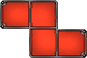

# reinforcement_learning_jigsaw_puzzle
In a computer game I liked to play as a kid there exist a minigame called Jigsaw. It is hard to do efficiently. The reward varies dependent on how much steps you need to solve, so it will be interesting to find a solver. It is a tetris like puzzle which can be solved easily using heuristics. For learning purpose I will use reinforcement learning

## Environment
conda create -n jigsaw numpy pytorch -c anaconda -c pytorch<br>
conda activate jigsaw
maybe use
```
conda create --name jigsaw  python
conda activate jigsaw
conda install -c "nvidia/label/cuda-11.8.0" cuda-toolkit
conda install pytorch torchvision torchaudio pytorch-cuda=11.8 -c pytorch -c nvidia
conda install -c anaconda numpy
```

## Rules
The Field consists of 4 rows and 6 cols and is initialized empty<br><br>


At each turn you can place a piece on the board or draw a random new one frome the card boxes.<br>


There are 6 possible puzzle pieces you can get out of the box:<br><br>





The game is done if the field is completely filled with forms with nothing empty.<br><br>


## Rewards
To get an idea about if this is bad or good here some information about the rewards:<br>
10 or fewer:<br>
Large treasure chest 
<br>11 to 24:<br>
medium treasure chest 
<br>25 or more:<br>
small tresure chest 

## Brute force
After setting up the basic rules for the game I created a brute force algorithm, which received following statistics on 100 runs:<br>
Average Brute Force (Turn: 32.08 Used: 10.74 Not used: 21.34)<br>
<br>
S = Small reward<br>
M = Medium reward<br>
L = Large reward<br>
R = Round number (=solved puzzles)<br>
T = Tiles used overall<br>
O = Average Tiles per round<br>


## Resources
https://www.toptal.com/deep-learning/pytorch-reinforcement-learning-tutorial
https://pub.towardsai.net/understanding-tensor-dimensions-in-deep-learning-models-with-pytorch-4ee828693826
https://en-wiki.metin2.gameforge.com/index.php/Fishing_Jigsaw
