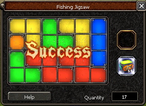

# reinforcement_learning_jigsaw_puzzle
In a computer game I liked to play as a kid there exist a minigame called Jigsaw. It is hard to do efficiently. The reward varies dependent on how much steps you need to solve, so it will be interesting to find a solver. It is a tetris like puzzle which can be solved easily using heuristics. For learning purpose I will use reinforcement learning

## Environment
conda create -n jigsaw numpy pytorch -c anaconda -c pytorch
conda activate jigsaw

## Rules
The Field consists of 4 rows and 6 cols and is initialized empty 

At each turn you can place a piece on the board or draw a random new one frome the card boxes.

There are 6 possible puzzle pieces you can get out of the box: 
id=0

id=1

id=2

id=3

id=4

id=5

The game is done if the field is completely filled with forms with nothing empty. 

## Brute force
After setting up the basic rules for the game I created a brute force algorithm, which received following statistics on 100 runs: 
Average Brute Force (Turn: 32.08 Used: 10.74 Not used: 21.34

## Rewards
To get an idea about if this is bad or good here some information about the rewards: 
10 or fewer: 
Large treasure chest 
11 to 24: 
medium treasure chest 
25 or more: 
small tresure chest 

## Resources
https://www.toptal.com/deep-learning/pytorch-reinforcement-learning-tutorial
https://pub.towardsai.net/understanding-tensor-dimensions-in-deep-learning-models-with-pytorch-4ee828693826
https://en-wiki.metin2.gameforge.com/index.php/Fishing_Jigsaw